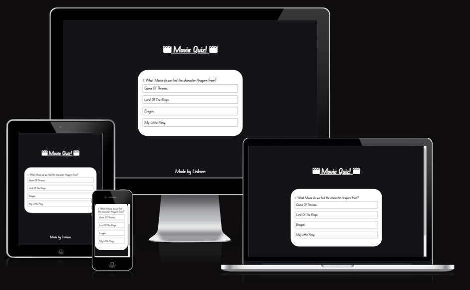
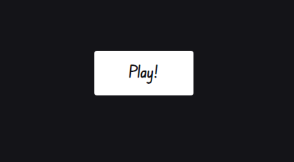
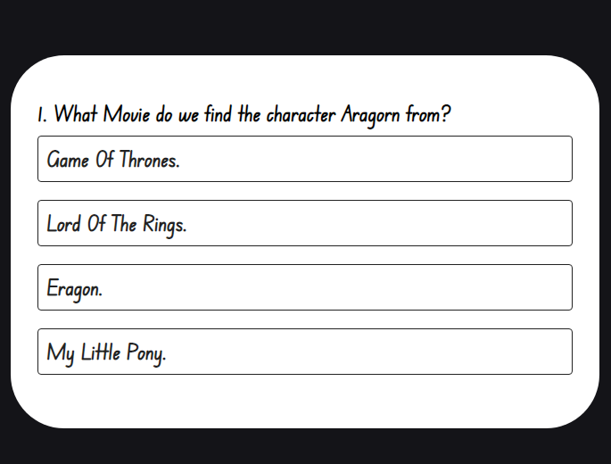
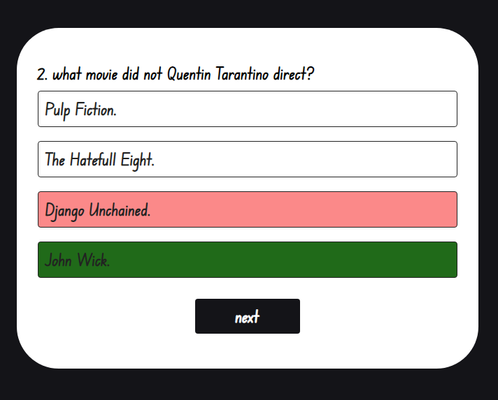
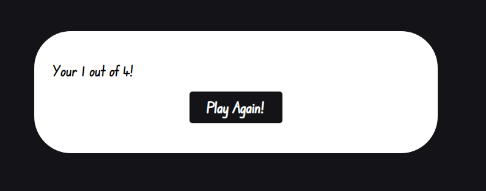

# Quiz-Game.

A small game made with simple html,css and javascript that anyone can use. The game is made up of two HTML pages one for the start page and one for the game. Some simple CSS nothing super fancy to give it a little bit of a more apealing design. Simple javascript. that takes the question from the already created array with questions and displays them correctly, And some nice user feedback with buttons getting diabled and disapearing when no availible. Aswell as changin color on hover and if the answer is correct or wrong. At the moment the game only has 4 questions related to movies but hopefully i will have time in the future to add more.

# Existing features.

## Play Button.
- Used to start the game and take you to the HTML Game page.

## Header.
- The header also used ass a homepage button 

## Game area.
- This section is how the game looks 
- Also displays how the javascript applies and removes classes from the buttons to make i more emersive.

## Score area.
- After the game is done and you have anwsered all the questions the score is displayed.
- And a new button apears that asks if you want to play again.

# Testing.

## Validator testing.
- HTML
    - No errors in the [W3C vaidator.](https://validator.w3.org/nu/#textarea) 

- CSS
    - No errors in the [Jigsaw validator.](https://jigsaw.w3.org/css-validator/validator)

- JavaScript
    - No errors only warnings for not using semicolons, [Jshint validator.](https://jshint.com/)
        - There are 9 functions in this file.

        - Function with the largest signature take 1 arguments, while the median is 0.

        - Largest function has 8 statements in it, while the median is 4.

        - The most complex function has a cyclomatic complexity value of 2 while the median is 2.

## Unfixed bugs.
 - No unfixed bugs that i can find in eather git hub or or Jshint validator.

 # Deployment.
- The site was deployed to GitHub pages. The steps to deploy are as follows:
    - In the GitHub repository, navigate to the Settings tab
    - From the source section drop-down menu, select the Master Branch
    - Once the master branch has been selected, the page will be automatically refreshed with a detailed ribbon display to indicate the successful deployment.

The live link can be found here: https://liskarn.github.io/Quiz-game/index.html

# Credits.
- Content 
    - The icons for the header is taken from: https://fontawesome.com/search?q=movie&o=r&m=free
    - The font style is taken from: https://fonts.google.com/
